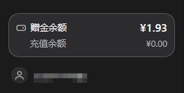

# dsh-balance-bar

> 给 DeepSeek Harness 的侧栏左下角加一栏余额 —— 就摆在你的账号名上方，点一下就打开「查询用量」。

**有赠金时**赠金余额作为主行、充值余额缩进灰化显示为次行；没有正额赠金时只画充值余额一行。卡片下方是 DSH 自带的账号行，插件不会重复显示它。

---

## 安装

需要拥有 Deepseek HARNESS。

跟它说，帮我安装 https://github.com/shpeee/dsh-balance-bar 这个插件即可。

## 已知限制

- 赠金 / 余额读取失败时该行显示「暂时无法查询」；此时点击卡片仍然会打开 Platform 页面，可以在那里看真实余额。
- 未登录时只显示一行「未登录」，点击会走新标签页到 Platform。
- Web 环境不使用内置页面（没有 `dshPlatform` 桥）。

## 许可

[MIT](LICENSE)